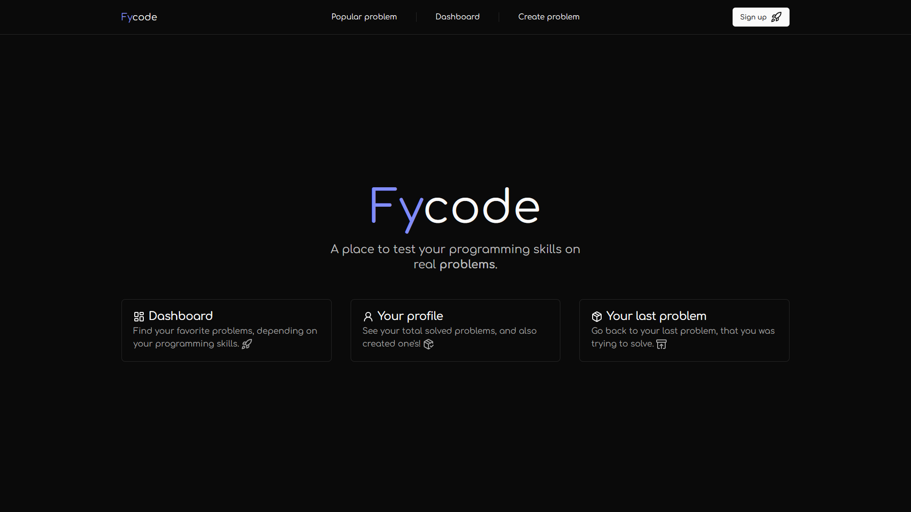

<h1 align="center">Fycode</h1>

<p align="center">A place to test your programming skills on real problems</p>
<p align="center"></p>

## How to run project

make sure you have installed:

- [Node.js](https://nodejs.org/en/)
- [pnpm](https://pnpm.io/)

add necessary enviroment variables

```env
NEXT_PUBLIC_SERVER_URL=""
NEXT_PUBLIC_CLIENT_URL=""

NODE_ENV="development" # change to "production" in production mode
```

then install all dependencies

```bash
pnpm install
```

run project in development mode

```bash
pnpm dev
```

or build

```bash
pnpm build
```

## TODO

- [+] code editor header
  - [+] language choose in code editor
- [+] code editor
- [+] code editor footer
  - [+] setup custom tests
  - [+] setup results
- [+] attempt and submit code buttons
- [+] user profile page
- [+] create problem page
